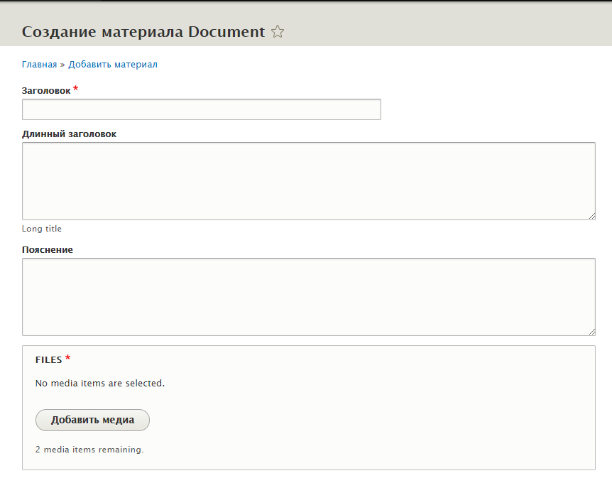
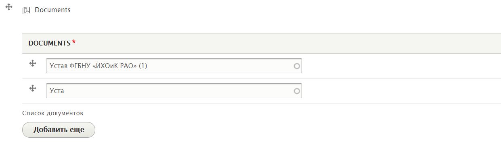

# Справочник документов

http://arti.docker.localhost/ru/admin/content/documents

Один **Документ** необходимо создать на сайте только один раз**.** Один и тот же документ может быть использован на сайте повторно.

**Документ** состоит из нескольких полей:

* **\***Наименование документа \(**Заголовок**\)
* Длинное наименование \(**Длинный заголовок**\)
* Пояснение
* **\***Файлы \(**FILES**\) _Не более двух \*.pdf + \*.docx_

Поле **Заголовок** используется в форме выбора документа для поиска. Используйте **Длинный заголовок,** если необходимо отображать документ на сайте с более длинным наименованием \(255+ символов\).

Для выбора документа в поле необходимо начать писать его наименование \(Значение поля **Заголовок**\). Далее будет предложен список выбора. В правильно заполненном поле в конце наименования всегда будет ID документа в скобках.

